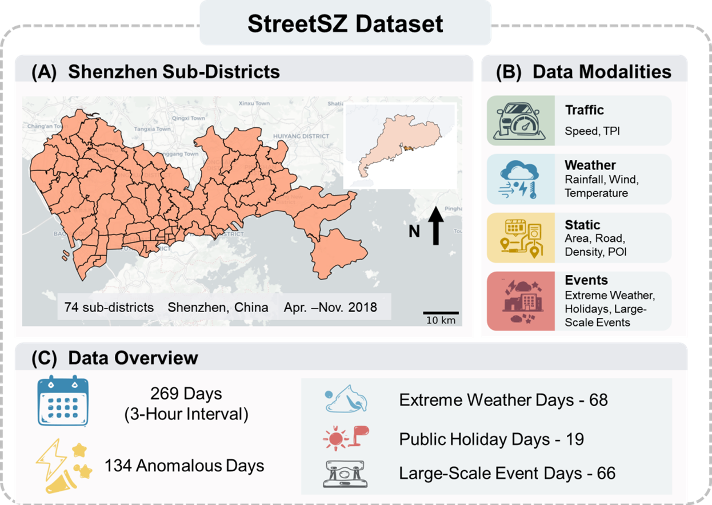

# MFGNN Package

This repository provides a cleaned and runnable release of the MFGNN pipeline for few-shot traffic forecasting on the StreetSZ dataset.

It includes:

- the core MFGNN model implementation
- Reptile-style meta-learning
- anomalous-event fine-tuning and evaluation
- the StreetSZ dataset files used by the package

## StreetSZ Overview



The figure above summarizes the StreetSZ dataset, including its spatial coverage, data modalities, and anomalous-event statistics.

## Repository Structure

```text
MFGNN/
|-- assets/
|   `-- streetsz_dataset_overview.png
|-- StreetSZ/
|   |-- StreetSZ.geo
|   |-- StreetSZ.rel
|   |-- StreetSZ.dyna
|   |-- StreetSZ.ext
|   |-- StreetSZ.fut
|   |-- StreetSZ.his
|   |-- Street_Attr.csv
|   |-- config.json
|   `-- shp/
|-- mfgnn/
|   |-- __init__.py
|   |-- data.py
|   |-- model.py
|   `-- train.py
|-- run_mfgnn.py
|-- run_full.bat
|-- run_smoke_test.bat
|-- requirements.txt
`-- README.md
```

## Requirements

- Python 3.10+
- PyTorch
- numpy
- pandas
- tqdm

Install dependencies with:

```bash
pip install -r requirements.txt
```

## Dataset Directory

The repository already includes `StreetSZ/`, so the default command can run without passing `--dataset-dir`.

If needed, you can still specify the dataset path explicitly:

```bash
python run_mfgnn.py --dataset-dir "E:\path\to\StreetSZ"
```

If `--dataset-dir` is omitted, `run_mfgnn.py` automatically searches several common locations and prints a clear error message if no complete StreetSZ dataset is found.

## Quick Start

Run the default training, fine-tuning, and evaluation pipeline:

```bash
python run_mfgnn.py
```

On Windows, you can also use:

```bat
run_full.bat
```

## Smoke Test

For a fast CPU-only validation run:

```bat
run_smoke_test.bat
```

This smoke test uses:

- `meta_epochs=1`
- `fine_tune_epochs=1`
- `num_tasks=1`
- `task_batch_size=1`
- `batch_size=2`
- `device=cpu`

You can still override arguments, for example:

```bat
run_smoke_test.bat --dataset-dir "E:\path\to\StreetSZ"
```

## Resume From a Meta Checkpoint

```bash
python run_mfgnn.py --meta-checkpoint ".\mfgnn_outputs\mfgnn_checkpoints\mfgnn_meta_epoch200.pt"
```

## Default Configuration

The default configuration follows the original notebook settings:

- `sequence_length=8`
- `forecast_horizon=4`
- `hidden_dim=64`
- `num_heads=4`
- `edge_hidden_dim=32`
- `num_layers=2`
- `dropout=0.1`
- `num_tasks=10`
- `support_ratio=0.8`
- `task_batch_size=4`
- `adapt_steps=2`
- `meta_lr=1e-3`
- `fine_tune_lr=5e-4`
- `meta_epochs=200`
- `fine_tune_epochs=15`

## Outputs

The pipeline writes results into `mfgnn_outputs/` by default:

- `mfgnn_checkpoints/mfgnn_meta_epoch*.pt`
- `mfgnn_checkpoints/mfgnn_final_finetuned.pt`
- `mfgnn_meta_loss_history.csv`
- `mfgnn_config.json`
- `mfgnn_metrics.json`

`mfgnn_metrics.json` contains:

- `full_test`
- `all_anomalous`
- `alert_weather`
- `holiday`
- `event`

Each scenario includes:

- `overall`
- `traffic_speed`
- `TPI`

## Validation Note

This release has been smoke-tested locally with:

- a minimal train/fine-tune/evaluate run
- resume-from-checkpoint execution

Training speed and final metrics may vary depending on hardware and environment.
